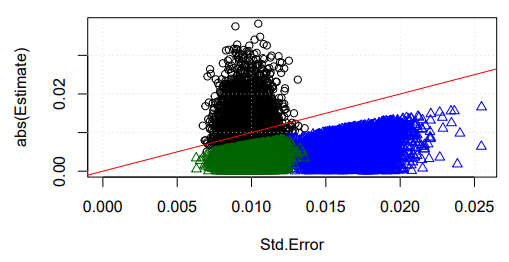

```{r}
#| label: init
#
# NOTE: if the package has changed, it must be installed locally via:
#
# devtools::install("C:/Users/phils/Documents/DSP/MD/MD2RP")
#
# You probably have to re-start r after this.
#
# *****************************************************
require( MD2RP)
require( parallel)
require( pracma)
require( data.table)
num_cores <- detectCores() - 1
options(digits=5)
```

## Update to Equilibrium Test

When we finished [Semi-Final.pdf](Semi-Final.pdf) we indicated that we needed to update the criteria for equilibrium, which had been simply using the F-Test with the probability being above 050%. However, we have made some very long runs (over 2M steps) and we see many runs which appear to be in equilibrium (or very close to it).

The previous definition was using any $F_p > 0.5$ as indication of validity. The reason being that if perfectly random data had greater than a 50% chance of causing that observation, any trend was likely spurious. However, we see that when millions of steps are run, regression will report that the slope is minuscule with high significance (thus, very small $F_p$). These cases are just as valid. So the new criteria will combine the two: $F_p > 0.5$ or the estimated slope is *small* with with significance (say, 95%). We define *small* as an error of less than 20% of the standard deviation of the temperature. Unfortunately, we must re-run all of the files through `procMD2DF()` to accomplish this. We could probably just run the invalid files, but is is possible, although unlikely, that the regression length will change with the expanded criteria. (it is unlikely because of the required small slope estimate will not likely be significant without many points.)

The code snippet below shows that all but four would be valid.

```{r}
#| label: four
MD2DF.B <- readRDS("MD2DF.B.RDS")
nv <- !with( MD2DF.B[ MD2DF.B$Fpvalue < 0.5,], 
      (Estimate * steps.avg / 2 < 0.2 * ke.sd.rs) & (Fpvalue <= 0.05))
MD2DF.B[ MD2DF.B$Fpvalue < 0.5,][nv, .(run, TE.mean.rs, Estimate, Std.Error, 
                                       Fval, Fpvalue, ke.sd.rs, steps.avg, nr)]
```

The other statistic that might be used is $t_\beta = \frac{\widehat\beta - \beta}{S_{\widehat\beta}}$, where $\beta$ is the slope (zero in our problem), $\widehat\beta$ is the estimate of the slope, and $S_{\widehat\beta}$ is the standard deviation of the slope estimate.

The below from [https://www.statology.org/working-with-the-student-t-distribution-in-r-dt-qt-pt-rt/](statology.org)

```{r}
#| label: fig-tstat
#| fig-cap: 'The distribution of the $t$ statistic for $\nu = 20$ degrees of freedom, thus the standard deviation is $s = \sqrt{20/18}$, or 1.0541.  The green region is the 5% confidence interval that the slope is zero.  The blue region each indicate a 95% confidence interval that the slope is *not* zero. As the degrees off freedom grow, the distribution becomes normal with zero mean and variance $\sigma^2 = \nu/(\nu - 2)$ (which approaches one).'
#Create a sequence of 100 equally spaced numbers between -4 and 4
x <- seq(-4, 4, length=100)
p <- qt(0.05, 20)
p2 <- qt( .475, 20)
x <- sort( c( x, p, -p, p2, -p2))

#create a vector of values that shows the height of the probability distribution
#for each value in x, using 20 degrees of freedom
y <- dt(x = x, df = 20)

#plot x and y as a scatterplot with connected lines (type = "l") and add
#an x-axis with custom labels
plot(x, y, type = "l", lwd = 2, axes = FALSE, xlab = "", ylab = "")
axis(1, at = -3:3, labels = c("-3s", "-2s", "-1s", "mean", "1s", "2s", "3s"))
polygon( c(-4, x[x <= p], p), c( 0, y[ x <= p], 0), col = 'blue')
polygon( c(-p, x[x >= -p], 4), c( 0, y[ x >= -p], 0), col = 'blue')
l <- min( which( x >= p2))
h <- max( which( x <= -p2))
polygon( x[c( l, l:h, h)], c( 0, y[ l:h], 0), col = 'green')
```

The tails of the F distribution are quite heavy, so the area accumulates in very thin strips. The plot below show the 50% tails.

```{r}
#| label: fig-fdist
#| fig-cap: 'F distribution for 1 and 20 degrees of freedom. The filled in regions show 50% point.'
#Create a sequence of 100 equally spaced numbers between 0.001 and 3
df1 <- 1
df2 <- 20
x <- seq(0.001, 3, length=1000)
cat( "5%: ", qf( 0.05, df1, df2), " 95%: ", qf( .95, df1, df2))
p <- qf( 0.5, df1, df2)
x <- sort( c( x, p, p2))

#create a vector of values that shows the height of the probability distribution
#for each value in x, using 20 degrees of freedom
yf <- df( x, df1, df2)

#plot x and y as a scatter plot with connected lines (type = "l") and add
#an x-axis with custom labels
plot(x, yf, type = "l", lwd = 2, axes = FALSE, xlab = "", ylab = "", 
     ylim=c(0, 3))
axis(1, at = 0:3, labels = c( "0", "1", "2", "3"))
polygon( c(0, x[x <= p], p), c( 0, yf[ x <= p], 0), col = 'green')
#l <- min( which( ))
h <- length(x)
polygon( c( p, x[ x >= p], 5),c( 0, yf[ x >= p], 0), col = 'blue')
```

The coordinate for 5% is `{r} qf( 0.05, df1, df2)`, which would not show up on the graph above. The 50% point is at `{r} p`. Back in September of 2024, when `runcombiner()` was updated (see [UpdatetoRuncombiner.pdf](.\Archived%20Notes\UpdatetoRuncombiner.pdf)) we ran little experiment to see how the update would work, resulting in @fig-firsttrial below.

{#fig-firsttrial}

The trials of 50 point regression seem quaint now. The points are 500 step block averages, so 50 points would be the equivalent of 25k steps. The 2M point runs have regressions of over 4,000 points. Let's update the above graph to show 4,000 point regressions. First, we need to copy the function `findlmlen()` from `UpdatetoRuncombiner.rmd` (the source file for the pdf) as the package has since been updated. Note that the code below does call the new version of `lmMD2()`, which returns an alternate `valid` item.

```{r}
#| label: oldfindlmlen
oldfindlmlen <- function( df, minp = 0.50) {
   kefit <- lmMD2( df)
   lendf <- nrow( df)
   if (kefit[ 'Fpvalue'] < minp) { # The data appears to be correlated
      third <- floor( lendf / 3) # Errs on the side of a longer 2/3s.
      ttdf <- tail( df, -third) # two thirds df
      kefit2 <- lmMD2( ttdf)
      if (kefit2[ 'Fpvalue'] >= minp) { # The 2nd 2/3s passed
       # Try to expand fit
         ftdf <- head( df, third) #first third df
         approach <- lmMD2( ftdf) # fit the approach to equilibrium
         if (sign( approach[ 'Estimate']) > 0) { # ke was growing
            adder <- which.max( ftdf$ke > min( ttdf$ke))
         } else {
            adder <- which.max( ftdf$ke < max( ttdf$ke))
         } # if (sign( approach...))
         newlen <- lendf - third + adder
         kefit3 <- lmMD2( tail( df, newlen))
         if (kefit3[ 'Fpvalue'] >= minp) return( kefit3) else
            return( kefit2)
         # the above `if` should return either way - no way to get here.
      } # if (kefit2....)
      # if we get here, then neither whole nor 2/3's passed.
   } # if kefit...
   # if we get here, then either the original fit passed the F-test,
   # or neither passed, so the original fit is returned.
   # The F p-value will show that this record is suspect.
   return( kefit)
}
```

10,000 evaluations of 4,000 points each (40M points total) takes some time, so a `parallel::parSapply()` application speeds it up.

```{r}
len <- 4000
(len3 <- floor(len/3))
trials <- 10000
 stopifnot("parallel" %in% .packages())
 # require( parallel) # only load if needed
cl <- parallel::makeCluster( num_cores)
parallel::clusterExport( cl, c( "len", "lmMD2", "oldfindlmlen", "combineruns"))
system.time( q <- t( # need to transpose the result of replicate
   parallel::parSapply( cl, integer( trials), 
                        function(i) oldfindlmlen( data.frame( step = 1:len, 
                                                  ke = rnorm( len))), 
                        simplify = "array")
      ) # t
   ) # system.time
parallel::stopCluster( cl)
head( q, 10)
```

The results of that are below.

```{r}
fails <- q[,'nr'] == len & q[,'Fpvalue'] < 0.5
flp <-  q[,'nr'] == len & q[,'Fpvalue'] >= 0.5 # full length pass
sp <- q[,'nr'] < len # short pass
cat( "Fails: ", sum( fails), "(passes: ", trials - sum(fails), ")", '\n')
cat( "Full Length Passes: ", sum( flp), '\n')
cat( "Shortened passes: ", sum( sp), '\n')
cat( "Exactly Two-Thirds: ", sum( q[,"nr"] == (len - len3)), '\n')
shorts <- q[,'Fpvalue'] >= 0.5 & q[,'nr'] < len
cat( "Averge shorter length: ", mean(q[ shorts,"nr"]), "\n" )
cat( "Max short pass: ", max( q[ sp,]))
```

The full correlation should fail about 50% of the time. A rather large amount of variability has been observed, but the procedure to revert to the last two-thirds adds perhaps half again as many successes. The plot below opens an interesting discussion.

```{r}
#| label: fig-estvstderr
#| fig-cap: "Absolute value of the estimate vs. the standard error, just as in @fig-firsttrial. Black points are failures, green are full length passes, and blue are shortened passes.  The red line shows equality (estimate equals the standard error)."
plot( abs(Estimate) ~ Std.Error, data=q[fails, ], 
      xlim=c(0, max( q[, 'Std.Error'])), ylim = c(0, max( q[, 'Estimate'])))
grid()
abline(a=0, b=1, col='red')
points( abs(Estimate) ~ Std.Error, data=q[ sp, ], col='blue',
       pch = 2)
points( abs(Estimate) ~ Std.Error, data=q[ flp, ], col='darkgreen',
       pch = 2)
```
That certainly looks different than the length 50 regression, but the essential character remains: the accepted passes all lie below the `Estimate = Std.Error` line. The variances of the resulting estimates are much tighter though, and so where we previously saw overlap between the green and blue regions (full and shortened passes, respectively), they are now well separated.  One other important difference is the magnitude of the slopes.  The 50 point runs showed slopes up to 0.03 (which is, after all, pretty small).  The 4,000 point run slopes are below about $5\times10^{-5}$. 

To put these in context, the regression line will go through the center of the blob of points, (between point 25 % 26, or 2000 & 2001) and then rise or fall by an amount equal to the slope multiplied by half the number of steps. So the 50 step regressions would drift by at most $0.03 \times 25 = 0.75$ units.  The 4,000 point regressions drift by at most $5\times10^{-5} \times 2,000 = 0.1$. Remember that the variance of both these are the same, so that is why we now compare the regression to the variance.


```{r}
#| label: fig-estvstderr2
#| fig-cap: "Absolute value of the estimate vs. the standard error, just as in @fig-firsttrial. As before, Black points are failures, green are full length passes, blue are shortened passes, and the red points are those added where the regression line ends 20/% or less than the standard deviation.  The red line shows equality (estimate equals the standard error)."
plot( abs(Estimate) ~ Std.Error, data=q[fails, ], 
      xlim=c(0, max( q[, 'Std.Error'])), ylim = c(0, max( q[, 'Estimate'])))
grid()
abline(a = 0, b = 1, col = 'red')
points( abs(Estimate) ~ Std.Error, data = q[ sp, ], col = 'blue',
       pch = 2)
points( abs(Estimate) ~ Std.Error, data = q[ flp, ], col = 'darkgreen',
       pch = 2)
new <- !(q[,"Fpvalue"] >= 0.5) & q[,"valid"]
points( abs(Estimate) ~ Std.Error, data = q[ new, ], col = 'red')
pl <- recordPlot()
png("estvstderrflm2.png", width=600, height=300)
replayPlot(pl)
dev.off()
```

So we see that the regression slope must be big enough to be declared "significant," but this yields a pathological result: smaller slopes are rejected due to lack of significance. So the significance test was clearly a mistake, and nothing more than an attempt to make the validity decision grounded in some sort of quantitative criteria being being simply within the standard deviation of the temperature (even is only 20/%f it).

```{r}
q[!q[,"valid"],]
```

