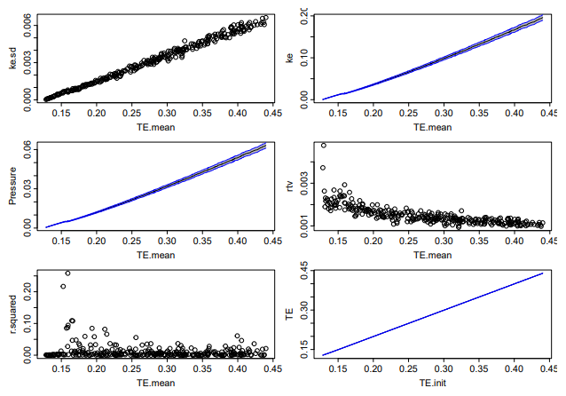
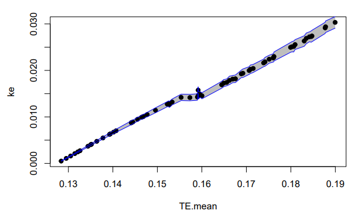
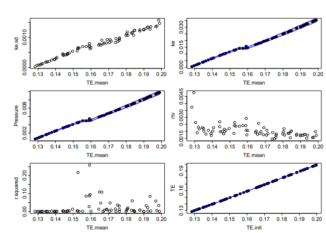
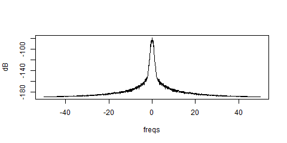
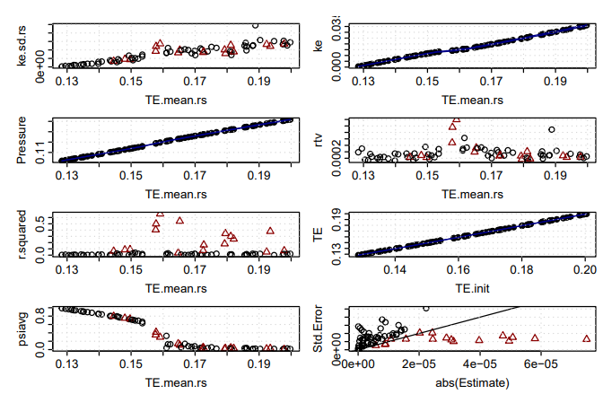
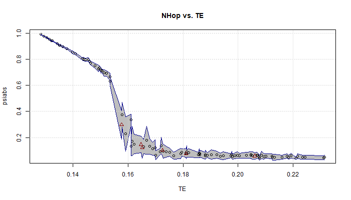
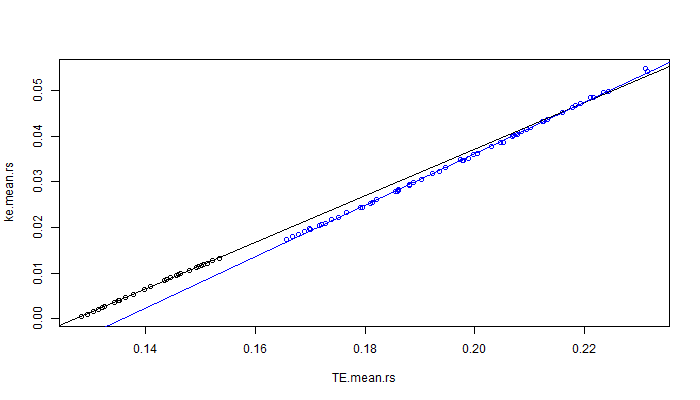
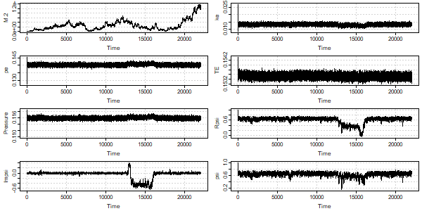

# Lab Notebook

This document contains the basic record of experiments nd runs for two dimensional molecular dynamics simulation.

The code was started in *Mathematica* in early 2024, but that was abandoned when it became clear that it was too hard to debug. Investigated a few possible alternatives, and decided on *Julia* as the best language to do high performance computing.

The first check-in was on 23 May 2024. The first full run with stable potential energy was a month later.

# Runs From Initialization

The first series of runs were from initialization, which was simpler than the 1980 Thesis code. The 1980 code used a technique described as "one which would be expected of an harmonic lattice (this is seen to during the process of disturbing the system)"[@Shea1980]. The current code simply starts the system in its rest position, giving each particle Gaussian velocities in each direction. The total energy is thus divided into potential energy as the system runs. No heating or cooling was implemented yet in the *Julia* code.

## Series 1

The first run of the system was on 18 July 2024. This series is documented in [Data-OverviewS1.pdf](file://C:/Users/phils/Documents/DSP/MD/MD2/Data-OverviewS1.pdf){.pdf}, archived on 1 August. The result was a possible location for the transition region. 300 runs were made, with initializations setting the mean temperatures of the particles from 0.001 to 0.300. Each run consisted of an initialization run of 1,000 steps, followed by two 5,000 step runs, so 11,000 steps total. There have been some changes to the *Julia* code since this was run, but the initialization was essentially like the code below.

``` julia
   ss.v .= randn( eltype( ss.v), ss.N)
   # each dimension has energy kT / 2 = V^2 / 2, E[V^2]=T
   ss.v .= sqrt( Temp) .* ss.v
```

where `Temp` was the initialization temperature. Note that the total energy includes the potential energy at rest. The nearest neighbors are at a distance of $a = \sqrt{\pi / \sin(\pi / 3)} \approx 1.90463$. The second nearest neighbors are at a distance of $a \sqrt{3} \approx 3.2989$. So the initial potential energy is one half of the energy between each particle. $1 / a^5 \approx .039898$, and the second nearest neighbor energy is $1 / (a\sqrt{3})^5 \approx .0025594$. Summing these and multiplying by three (half of six) yields a per particle potential energy at rest of $0.127373$.

The complete summary is below. Each item is a summary of the 10,000 steps following the 1,000 steps after initialization. The data is in `MD2DF.S1.Rdata`.

{#fig-allS1}

The `r.squared` response identified an area of interest. A zoomed in plot of kinetic energy (i.e., temperature) versus total energy is below.

{#fig-allS1z}

It was also apparent that there were large gaps in the total energy even though the energies were initialized incrementally. This was suspected to be due to the random nature of the initialization, where the total energy was simply the variance of 512 (i.e., $256 * 2$) random normal deviates.

The initial data ran some very hot runs, so a plot zoomed into the transition region is below.



It was also noted that this series did not zero the angular momentum at initialization. While angular momentum is not conserved by the periodic boundary conditions, no good can come of initializing a run with angular momentum.

## Series 2

Correction for random angular momentum was added to the *Julia* code, and a new set of runs were created to span the transition region. The Nelson-Halperin order parameter [@Halperin1978] was also computed now. The new summary includes this, plus a plot of the standard error of the slope of the temperature plotted against the absolute value of the estimate itself. It took two tries (executed on 21 and 22 August 2024), but we eventually ended up with 100 runs spanning total energy per particles of just above 0.127 to almost 0.2. The summary plot is below. The complete overview of this step in the research is in [DataOverviewS2.pdf](file://C:\Users\phils\Documents\DSP\MD\MD2\DataOverviewS2.pdf). The summarized data is in `MD2DF.S2.Rdata`.

{#fig-initS2}

Some of these should be explained. `ke.sd` is the standard deviation of the kinetic energy. `rtv` is simply `(ke.sd/ke.mean)^2`. For each run, we would perform a linear regression of the temperature vs. step number. `r.squared` is the correlation coefficient of that regression (we are looking for no correlation). The `Estimate` item is the slope of the regression, and `Std.Error` is the standard deviation of that estimated slope (the odd names are assigned by R functions). The thinking here is that if the slope is less than the error, then there is no correlation.

We did observe energy loss, but it was below 0.5%. The plot below shows that.

{#fig-Eloss}

This can be seen in a plot of the of the combined runs. The `TE` quickly drops. Note also that the linear momentum, which should remain zero, bounces around a bit too. Note also that it remains less than $10^{-20}$.

{#fig-S20036}

The division between potential and kinetic energy was also examined. The plot below shows this.

{#fig-keloss}

### Spectral Processing

The kinetic energy line appeared to have some spectral content, and this may prove interesting. Spectral estimation code was already available, and the following was executed (`x` was a data frame returned from `combineruns`, which creates a data frame of each variables as columns, and each step as rows):

``` r
sx36 <- detrend( tail( x[, "ke"], -2000)) # remove mean and linear trend
x36sdf <- qsdf(sx36, blocksize=4096, yrange=110, dt=0.01)
```

As is evident, the first 2,000 points was skipped. The `qsdf` function will break the signal into overlapping blocks of `blocksize`, with 50% overlap being the default. The default is also to apply a Hanning window. With only 9,000 points (after skipping 2k), the spectrum is only 3 blocks long. Note that the plot in `Data Overview S2.pdf` appears to be incorrect; the correct plot is below:

{#fig-S20036fspec}

Zooming in we can see the following:

{#fig-S20036fspecz}

The blue lines are at $\pm 0.708/\tau$ for a main lobe width of $1.416/\tau$. Since the sample rate is $0.01\tau$, the spectral width is the equivalent of about 70 samples. To create a block average which will encompass that, it would have to be at least twice that wide (as the null-to-null bandwidth of main lobe of the average is twice the reciprocal of the block average size).

#### Detour on Regression

A surprising plot was made of the regression slope estimate divided by the standard error of that estimate, plotted against the regression coefficient. This turned out to be a parabola, which was surprising. A complete investigation revealed that this was an artifact of how the data was produced. This is all documented in [Regression_Ratios.pdf](file:///C:/Users/phils/Documents/DSP/MD/RegressionRatios/Regression_Ratios.pdf), a paper written in LaTeX on [Overleaf](https://www.overleaf.com/project). Ultimately decided on using the $t$ statistic to decide if a run had no real slope, generally using a 50% confidence interval (that is, if the confidence that the slope was zero was 50% or greater, it would be considered valid equilibrium).

### Re-sampling and Autocorrelation

Experience from 1980 and the results reported in [@Novaco1982] indicates that we need to use average temperatures and pressures to decide if we have reached equilibrium.. In 1980, we we used 1k samples as it was the basic simulation block, but today I would like a more rational answer. The autocorrelation of four runs was examined to see what should be done.

| Symbol Name | File Name | Mean KE | $r^2$  | Mean TE |
|------------:|:---------:|:-------:|:------:|:-------:|
|         x10 |  S2.0010  | 0.0047  | 0.0003 | 0.1364  |
|        xn02 |  S2.0033  | 0.0154  | 0.1931 | 0.1615  |
|         x36 |  S2.0036  | 0.0146  | 0.2887 | 0.1591  |
|        x100 |  S2.0100  | 0.0499  | 0.0230 | 0.2242  |

: Summary of autocorrelation runs. {#tbl-AutoCorr4tb}

Below are the four auto-correlations. Note that they have not been de-trended, so `xno2` and `x36` are affected by trends.

{#fig-Autocorr4fig}

While 200 appears to be sufficient for the hot (`x100`) sample, the problematic transition samples near total energies of 0.16 per particle need a bit more, perhaps 400.

Below is the last summary plot of the variables.

{#fig-S2summ}

### Updating `runcombiner.r`

The *Julia* code produces step-by-step data in blocks of steps. This is for two reasons: 1) a run may need to be extended, and so another block of data could be added to existing runs, rather than starting over from the beginning, and 2) stuff, happens, and if a million steps is desired, experience has shown that having data written to "disk" occasionally is wise. This second reason may seem silly when a thousand steps can be run in .16 seconds, but as the size of the system is expanded, this will become important. Nevertheless, that is how the code is structured, and so the steps must be combined. This was done in R, as of this writing in a single file named `runcombiner.R`. The record of this is in [UpdatetoRuncombiner.pdf](file:///C:/Users/phils/My%20Drive/DSP/MD/UpdatetoRuncombiner.pdf).

The re-sampled data with a regression on the last 2/3 of the data is represented in @fig-x33resamp below:

{#fig-x33resamp}

The algorithm to determine if a run has reached equilibrium is below (in seven easy steps):

1.  Skip the first 1,000 points as a general rule.
2.  Re-sample the kinetic energy (`ke`) column.
3.  Regress the re-sampled column, and check if the F statistic p-value is below 50% (that is, if the data were truly random and uncorrelated, there is a 50% chance that we would reject the large the data set and and move to the next step). If it passes the F-test, accept the data as uncorrelated, and compute the averages for the rest of the columns.
4.  Having failed the first F-test, take the last two-thirds of the data, and repeat the F-test. If this fails, then a longer run is needed (i.e., we require that equilibrium be at least twice as long as the approach to equilibrium). At this point, simply report the full record's averages, and let the statistics indicate the record's problem.
5.  If the second F-test passes, then compute the mean, min, and max of the two-thirds data, and also compute the regression of the first third. This second regression will give the direction of the temperature movement.
6.  Find the last point outside the min or max of the two-thirds data. If the second regression has a positive coefficient (i.e., the ke is rising), use the min, and use the max otherwise.
7.  Perform a third regression on the new set of points. If the F-test fails, then resort to the original two-thirds data. If the use the F-test passes, use the expanded data set for the averages.

The above has been encapsulated in the `findlmlen` function, and incorporated into the `createdf` function. A rather large amount of work went into extending the last two thirds back into the series, so an experiment was run on random data. THe following R code was the experiment (displayed here because of its marvelous simplicity):

```{r}
#| eval: false
len <- 50
(len3 <- floor(len/3))
trials <- 10000
q <- t( # need to transpose the result of replicate
   replicate( trials, findlmlen( data.frame( step = 1:len, ke = rnorm( len)))))
```

This generated 10,000 length 50 series of random data and ran `findlmlen` on them. The results are in @tbl-findlmtst below.

|               Item | Count  | Percent |
|-------------------:|:------:|:-------:|
|       Total Trials | 10,000 |  100%   |
| Full Length Passes | 5,007  |  50.1%  |
|   Shortened Passes | 2,231  |  22.3%  |
|        Exactly 2/3 |  393   |  3.9%   |
|  Lengthened Passes | 1,838  |  18.4%  |
|      Failed Passes | 2,762  |  27.6%  |

: Results of `finlmlen` on random data. {#tbl-findlmtst}

The first thing to notice: the expected number of full length passes is 50%, and this was observed. Of the 2,231 shortened passes, 82% were lengthened. The 1/3 length is given by `len3 <- floor( 50/3)` which is 16. The 2/3 length is 50 - 16 = 34. The average length of the shortened runs was 34.88, so it looks like most runs were only lengthened by 1 point. The maximum short pass was 38 (lengthened by 4). A plot of the result is below.

{#fig-regtest}

There were two iterations, with the final summarization of the data performed with re-sampling block size of 500. The updated summary data is in `MD2DF.3.S2.Rdata`. The summary plot of the data is in @fig-MD2DF3S2 below:

{#fig-MD2DF3S2}

The runs note considered valid are as follows:

``` r
rerun <- with( MD2DF, {MD2DF[ Fpvalue < 0.5, c('series', 'energy')]}
rerun$energy
 [1] "0021" "0028" "0029" "0030" "0031" "0033" "0036" "0037" "0038" "0041"
[11] "0045" "0046" "0049" "0051" "0052" "0053" "0056" "0059" "0066" "0067"
[21] "0070" "0071" "0073" "0074" "0079" "0082" "0083" "0091" "0092"
```

## Extending Runs

On 22 and 23 September 2024 (one month following the first S2 runs), the runs listed above were extended by 15k steps (more than doubling their length), and new runs were made in the transition region. The details are documented in [ExtendRuns1.pdf](file:///C:/Users/phils/Documents/DSP/MD/MD2/ExtendRuns1.pdf). As noted in the pdf, an error had been spotted in the procedure `procMD2DF` and so the entire suite of files had to be reprocessed. The reprocessed data was saved in `MD2DF.4.S2.Rdata`. Note that I reorganized some files, and this file was missing, but as the run data was still available, it was re-created (and saved) on 12 October 2024. The state of the main scalars is shown below in @fig-MSER1.

![Eight key parameters, the first six (counting top-to-bottom, left-to-right) plotted against the mean total energy per particle. They are 1) the standard deviation of the kinetic energy, 2) the pressure, 3) the correlation coefficient, 4) the average of the modulus of the Nelson-Halperin order parameter, 5) the kinetic energy, and 6) the relative variance of the kinetic energy (i.e., the standard deviation divided by the mean). Then the total energy vs. the initialization total, and last the standard error of the slope estimate vs. the absolute value of the slope (with a a line showing where they are equal). Black circles indicate data declared valid and red triangles are data whose regression had too much significance (F-test p-value \< 0.5).](Mainscalars%20ER1.png){#fig-MSER1 width="650"}

The Nelson-Halperin order parameter $\psi = \frac{1}{2(N-1)}\sum_{i \ne j} e^{i6\theta_{i j}}$, where $\theta_{i j}$ is the angle with the $x$-axis of the vector from particle $i$ to $j$ (the factor of 2 because in the above, each particle is counted twice). This is very sensitive to the transition. @fig-NHOPER1 below shows the current state with $\pm\sigma$ error band.

{#fig-NHOPER1 width="700"}

We assume that the runs below $0.155\epsilon$ belong to the frozen (solid phase) systems, and the valid runs above $0.165\epsilon$ belong to the fluid phase. Linear fits to the two regions result in the lines in @fig-LinFitsphaseER1:

{#fig-LinFitsphaseER1}

### Update Initialization Code

The next series of runs needs to extend the runs elicited above, plus fill in the energies that are missing. The `InitMDRecord!` function was updated to zero in on the energies in a better way. Previously, the energy was set as a parameter to the random number generation, but the random generation could result in many different energies. The old code was as follows:

``` julia
    ss.v .= sqrt( Temp) .* randn( eltype( ss.v), ss.N)
```

The new code is as follows:

``` julia
    ss.v .= randn( eltype( ss.v), ss.N)
    ke = 0.5 * sum( dot.(ss.v, ss.v)) / ss.N
    ss.v .= sqrt( Temp / ke) .* ss.v
```

As can be seen, the random numbers are generated first, and then they are scaled to meet the temperature. It is still not exact, as linear and angular momentum are corrected after the kinetic energy generation, and this does change it a bit, but it ought to be a lot closer now.

### Melting!

Over 13 & 14 October 2024, extended a few runs to over one million steps. There where a few runs which stood out: one which had not reached equilibrium when the runs at energies above and below it did, and one which reached equilibrium when the runs above and below it did not. On 21 October, this caused me to look at the `S2B.0027` run in detail. This first revealed that the `combineruns` routine had an error, in which the sort by `file.time` was silently failing, and the runs were jumbled. The entire notebook `ExtendRuns2.qmd` is invalid now, although a re-run may give odd results. It will be re-run and archived.

Nevertheless, in this process, run `S2b.0027` was examined and the following was the result.

{#fig-S2b0027 width="600"}

We can see that the total energy is decreasing, which might be concerning. The reduction is 0.8%. This is likely due to particles slipping out of the `rskn` range of the potential. Note that simultaneously, the potential energy (`pe`) is increasing and the kinetic energy (`ke`) is decreasing.

## Confused Executions

The collision of file names caused a lot of confused executions noticed on 23 October 2024. This resulted in re-processing everything from the last known good run (that is, ending in at most a capital letter). In the process, the melting observed above did not recur, at least not like it did previously.

{#fig-xn27}

Backed off the data analysis for a while, and started fixing `createdf` to allow updating records. This caused me to put all the `R` code into a formal package. I got it to pass `R CMD check` on 7 November. I re-created `MD2DF.9` (which has the `run` and the last filetime columns) on 8 November.

# Semi-Final Runs

We now (18 November 2024) have a set of consistent runs and a pretty full complement of very long runs. While some of the very long runs are recorded as valid, they are likely not.

{#fig-MD2DFB}

The lengths of the runs vary, with very long runs centered around the transition region.

{#fig-stepsvTE}

The hottest solid run had a total energy of $0.1535\epsilon$ per particle, and the Nelson-Halperin parameter was 0.63. We also plotted the parameter as a polar plot:

{#fig-S20029polar}

## Nelson-Halperin Order Parameter

There are two metrics recorded: `psiavg` and `psiabs.mean.rs`. The parameter is reported step-by-step as as real and imaginary components of the base parameter. Its calculation is as follows:

$$
\psi_s = \frac{1}{N_q} \sum_{j = 1}^{N_p} \sum_{k \ near\ j} e^{i 6 \theta_{j,k}}
$$

where $s$ is the step number, $N_p$ are the number of particles, $k \ near\ j$ means the particles "near" particle $j$ such that $k > j$ (and near is simply defined as less than 3/2 of the mean inter-particle distance, a constant in the calculation), and $\theta_{j,k}$ is the angle between the x-axis and the vector between particles $j$ and $k$. $N_q$ is the count of those particles that met the $k\ near\ j$ criteria. $\psi_s$ is a complex quantity whose magnitude indicates the average alignment of the particles (and i*is* the fourier coefficient of 6-fold spacing). Since we have the step-by-step value of $\psi_s$, we can perform the average two ways. Perhaps the obvious is to compute the magnitude of $\psi_s$ and then average that. This is $\langle |\psi_s| \rangle$, where the magnitude is computed at each step (and that is what is plotted step-by-stepin `plotMD2`). The analogy to Fourier estimation is supported by this technique, in which multiple spectrums taken at different times are averaged in magnitude. The other value we can compute is the magnitude of the average, or $|\langle \psi_s \rangle|$. The spectral analogy is of the magnitude of a single high resolution Fourier coefficient They are both plotted in @fig-bothpsi below.

{#fig-bothpsi}

There is little doubt that $\theta$ is rotating. We actually saw this in run `S2b.0027`. @fig-xn27anglez2 below is a plot of the angle and magnitude of $\langle \psi \rangle_{N_q}$, there the notation is to indicate that each point is an average over the $N_q$ particles.

{#fig-xn27anglez2}

Finally, we were able to go back and re-execute some of the steps and plot them in a gif file.

`images/gs.S2b.0027.0057b.gif`

# Transition Region as of 26 November 2024

Assuming that most of the runs are in equilibrium, the transition region can be discerned by performing regression fits to the solid and fluid regions.

{#fig-treg width="600"}

Zooming into the region shows important detail .

{#fig-tregz}

Below is the regression for the fluid region:

```{r}
#| label: wtlm
#| eval: false
fwlm <- lm( ke.mean.rs ~ TE.mean.rs, data=vf, weights = 1/(vf[,ke.sd.rs])^2) # fluid lm
(sfwlm <- summary( fwlm))
```

```         
Call:
lm(formula = ke.mean.rs ~ TE.mean.rs, data = vf, weights = 1/(vf[, 
    ke.sd.rs])^2)

Weighted Residuals:
   Min     1Q Median     3Q    Max 
-1.109 -0.401 -0.114  0.302  2.010 

Coefficients:
             Estimate Std. Error t value Pr(>|t|)    
(Intercept) -0.074968   0.000399    -188   <2e-16 ***
TE.mean.rs   0.555858   0.002141     260   <2e-16 ***
---
Signif. codes:  0 ‘***’ 0.001 ‘**’ 0.01 ‘*’ 0.05 ‘.’ 0.1 ‘ ’ 1

Residual standard error: 0.623 on 61 degrees of freedom
Multiple R-squared:  0.999, Adjusted R-squared:  0.999 
F-statistic: 6.74e+04 on 1 and 61 DF,  p-value: <2e-16
```

The following code generated the solid regression through the known zero-temperature energy point.

```{r}
#| label: intreg
#| eval: false
minpe <-  0.127373
swlm2 <- lm( ke.mean.rs ~ I(TE.mean.rs - minpe) - 1, data=vs, 
             weights = 1/(vs[,ke.sd.rs])^2)
summary( swlm2)
```

```         
Call:
lm(formula = ke.mean.rs ~ I(TE.mean.rs - minpe) - 1, data = vs, 
    weights = 1/(vs[, ke.sd.rs])^2)

Weighted Residuals:
    Min      1Q  Median      3Q     Max 
-1.9612 -0.6539  0.0757  0.6193  1.2374 

Coefficients:
                      Estimate Std. Error t value Pr(>|t|)    
I(TE.mean.rs - minpe)   0.5192     0.0013     400   <2e-16 ***
---
Signif. codes:  0 ‘***’ 0.001 ‘**’ 0.01 ‘*’ 0.05 ‘.’ 0.1 ‘ ’ 1

Residual standard error: 0.875 on 27 degrees of freedom
Multiple R-squared:     1,  Adjusted R-squared:     1 
F-statistic: 1.6e+05 on 1 and 27 DF,  p-value: <2e-16
```

Looking at the specifics of the data, it is obvious that some of the "not valid" points would be declared valid, so a regression on the fluid region including all points above $0.157\epsilon$, regardless of the point's status. This is plotted in @fig-tregz3.

{#fig-tregz3}

Created a function (not yet incorporated into the `MD2RP` package) that lists most of the 59 columns of all scalars. See @fig-MD2DFBAll for the plot and explanations.

{#fig-MD2DFBAll}

# New Definition of Validity

The previous definition was using any $F_p > 0.5$ as indication of validity. The reason being that if perfectly random data had greater than a 50% chance of causing that observation, any trend was likely spurious. However, we see that when millions of steps are run, regression will report that the slope is minuscule with high significance (thus, very small $F_p$). These cases are just as valid. So the new criteria will combine the two: $F_p > 0.5$ or the estimated slope is *small* with with significance (say, 95%). We define *small* as an error of less than 20% of the standard deviation of the temperature. Unfortunately, we must re-run all of the files through `procMD2DF` to accomplish this. We could probably just run the invalid files, but is is possible, although unlikely, that the regression length will change with the expanded criteria. (it is unlikely because of the required small slope estimate will not likely be significant without many points.)

The code snippet below shows that all but 4 would be valid.

``` r
nv <- !with( MD2DF.B[ MD2DF.B$Fpvalue < 0.5,], 
      (Estimate * steps.avg / 2 < 0.2 * ke.sd.rs) & (Fpvalue <= 0.05))
MD2DF.B[ MD2DF.B$Fpvalue < 0.5,][nv, 
                     .(run, TE.mean.rs, Estimate, Fpvalue, ke.sd.rs, steps.avg)]
```

| Run | Mean Total Energy | Slope Estimate | Fp Value | ke standard deviation | Steps in Averages |
|------------|------------|------------|------------|------------|------------|
| S2b.0026 | 0.15246 | 1.1643e-08 | 0.00075 | 0.00026185 | 2,050,000 |
| S2b.0032 | 0.15834 | -3.5342e-09 | 0.4517 | 0.00038216 | 2,150,000 |
| S2.0033 | 0.16146 | 5.1504e-09 | 0.2348 | 0.00033092 | 2,060,000 |
| S2.0039 | 0.16786 | 1.3377e-06 | 0.1996 | 0.00039460 | 60,000 |

: Runs remaining not-valid under new criteria with current averages.

The next step here is to upgrade `procMD2DF`, and update the plotting algorithms to deal with a `valid` tag vs. simply filtering on `Fpvalue`.



# References
